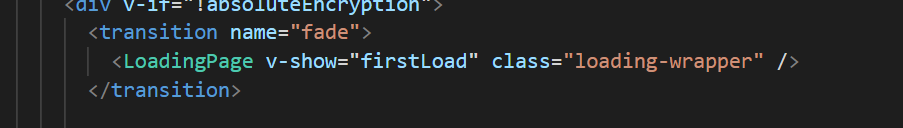

::: tip 介绍
1. 使用 vuepress，基于 vuepress-theme-reco 搭建个人博客系统<br>
2. 主题追求极简，根据 vuepress 的默认主题修改而成，官方的主题配置仍然适用；<br>
:::

## 搭建博客需要了解的技术
- **vuepress**
- **vuepress-theme-reco**
- **vue**
- **git**

## 构建博客

### 一丶通过reco主题搭建博客

你可以选择 npm or yarn

**npm**

```bash
# 初始化
npm install @vuepress-reco/theme-cli@1.0.7 -g
theme-cli init
```

**yarn**

```bash
# 初始化
yarn global add @vuepress-reco/theme-cli@1.0.7
theme-cli init
```

**初始化包**

```bash
npm install
```

**运行项目**

```bash
npm run dev
```

**预览主题效果**


**进行开发**

通过reco主题官网[vuepress-theme-reco](https://vuepress-theme-reco.recoluan.com/views/1.x/)进行开发

### 二丶克隆已发布的blog

1. 以我的博客为例，通过git克隆到本地：`afafafaf`

2. 同样进行构建包 `npm install`

3. 开发你的blog

## 一些注意事项

### 关于`sidebar`与`subsidebar`

在最新的版本中，`sidebarDepth`已经不在生效，默认其二级标题与三级标题在右侧边栏显示，右侧边栏开启代码为：
```bash
//在config.js中的themeConfig里配置如下
subSidebar: 'auto'
//在所有页面中启用自动生成子侧边栏
```

### 关于loadingpage

新版本已经去除loadingpage组件与插件，想要自己加入的话需要自己修改主题，具体操作如下：
- 首先在 theme/components下加入LoadingPage组件<br>
页面加载页组件取自node_modules@vuepress-reco/vuepress-plugin-loading-pag<br>
原主题插件地址：https://www.npmjs.com/package/@vuepress-reco/vuepress-plugin-loading-page <br>
- 在common组件下加入如下代码：
```js
<LoadingPage v-show="firstLoad" class="loading-wrapper" />
```


### 关于首页打字机

- 在 VuePress 中,所有在 .vuepress/components 中找到的 *.vue 文件将会自动地被注册为全局的异步组件。
- 我们直接使用这些组件在任意的 Markdown 文件中就可以了。
- 在 components 目录下新建一个 NewFont.vue 文件，并填入以下代码：

<RecoDemo :collapse="true">
  <template slot="code-template">
    <<< MyBlog/.vuepress/components/NewFont.vue?template
  </template>
  <template slot="code-script">
    <<< MyBlog/.vuepress/components/NewFont.vue?script
  </template>
  <template slot="code-style">
    <<< MyBlog/.vuepress/components/NewFont.vue?style
  </template>
</RecoDemo>

- 在README.md中使用


### 关于切换主题
这里我修改了主题原有的更换model组件效果自行查看
1. 将.vuepress/theme/components/Mode/index.vue全部替换为如下代码：

<RecoDemo :collapse="true">
  <template slot="code-template">
    <<< MyBlog/.vuepress/theme/components/Mode/index.vue?template
  </template>
  <template slot="code-script">
    <<< MyBlog/.vuepress/theme/components/Mode/index.vue?script
  </template>
  <template slot="code-style">
    <<< MyBlog/.vuepress/theme/components/Mode/index.vue?style
  </template>
</RecoDemo>

2. 查看效果即可

### 关于插件
vuepress 与 vuepress-theme-reco 给我们提供了许多好用与好看的插件，大加可以在官网自行查看并使用。
下面是我用到的插件：
```js
// 这里封装博客所需要用到的插件

module.exports = [
  // 使用来自依赖包的插件
  //如果插件名以 vuepress-plugin- 开头，你可以使用缩写来省略这个前缀

  //为博客文章自动随机添加名人名言或其他，可自定义样式和内容的插件。 https://github.com/zpj80231/vuepress-plugin-boxx
  [
    'vuepress-plugin-boxx'
  ],
  [
    'reading-progress'
  ],
  // 添加动态标题的插件  https://github.com/moefyit/vuepress-plugin-dynamic-title
  // [
  //   'vuepress-plugin-dynamic-title',
  //   {
  //     showIcon: '/favicon.ico',
  //     showText: '(/≧▽≦/)花园朵朵开~',
  //     hideIcon: '/failure.ico',
  //     hideText: '(●—●) oh No！不要走！',
  //     recoverTime: 2000,
  //   }
  // ],

  // 评论插件 这里选用valine, 主题已经预配置好，见 index.js
  // https://www.npmjs.com/package/@vuepress-reco/vuepress-plugin-comments
  // [
  //     '@vuepress-reco/vuepress-plugin-comments'
  // ],

  // 图片懒加载
  // https://github.com/tolking/vuepress-plugin-img-lazy
  [
    'img-lazy'
  ],
  [
    '@vuepress-reco/extract-code'
  ],

  // 代码块复制代码功能 掘金风格
  // https://www.npmjs.com/package/vuepress-plugin-nuggets-style-copy
  [
    "vuepress-plugin-nuggets-style-copy",
    {
      copyText: "复制",
      tip: {
        content: "复制成功!"
      }
    }
  ],
  [
    "permalink-pinyin",
    {
      lowercase: true, // Converted into lowercase, default: true
      separator: "-", // Separator of the slug, default: '-'
    },
  ],

  // PWA插件
  // https://github.com/vuejs/vuepress/tree/master/packages/%40vuepress/plugin-pwa
  [
    '@vuepress/plugin-pwa',
    {
      serviceWorker: true,
      updatePopup: {
        message: "发现新的内容~",
        buttonText: "刷新"
      }
    }
  ],
]
```
